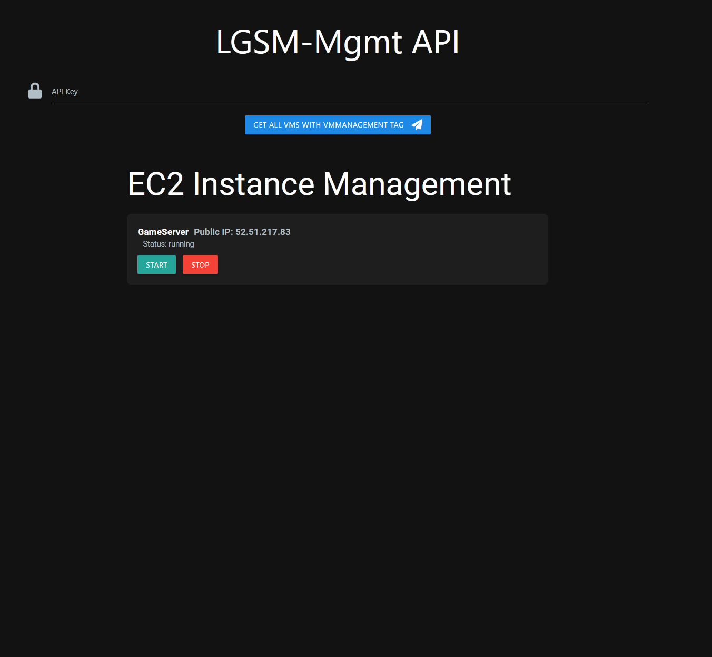

# LGSM-AWS

## Overview

LGSM-AWS is a project designed to automate the deployment and management of game servers on AWS using a combination of Terraform, Ansible, and Docker. This project leverages Infrastructure as Code (IaC) principles to provision and configure virtual machines (VMs) and deploy game servers with minimal manual intervention.

## How to use
Once everything has been setup, you can extract the apiKey from the terraform statefile in ./intrastructure/terraform/lambdas/vm-managment. 

The website is reachable under lsgm.{YOUR-SUBDOMAIN}/mgmt 

Provide the API token and fetch the VMs. You can start and stop them from here.

## Setup Prerequisits
    1. An existing aws account 
    2. Creat a IAM user that can be used for terraform all resources in AWS
    3. An external domain, where you can set NS entries. 
    4. Install terraform and docker +  docker-compose

## Getting started